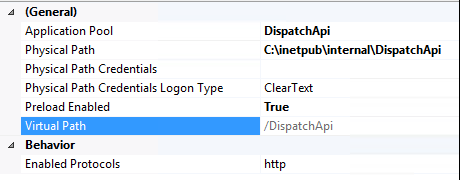

hermes
======

Dispatch Notification Suite.


## How to install

0. Go to [releases](https://github.com/Apex-net/hermes/releases)
0. Download latest version of `dispatch/api/v*.7z`
0. Extract contents of `DispatchApi-v*.7z`
0. Convert extracted folder to Application in IIS (Target framework: **.NET 4.5**)

## IIS Configuration

0. Application Pool Advanced Settings: set "Start Mode" = "AlwaysRunning"


0. Web Site Advanced Settings: set "Preload Enabled" = "True"



## Configuration

The only mandatory configuration is setting available storage option via `JobStorageName` in application settings:

```xml
<applicationSettings>
  <Apexnet.Dispatch.Api.Properties.Settings>
    <setting name="JobStorageName" serializeAs="String">
      <value>hangfire-memory</value>
    </setting>
  </Apexnet.Dispatch.Api.Properties.Settings>
</applicationSettings>
```

Available values for `JobStorageName` are: `hangfire-redis` or `hangfire-memory`.

### Memory storage

No configuration is necessary.

### Redis storage

Complete definition for `redisStorage` is:

```xml
<HangfireStorage xmlns="urn:Apexnet.JobQueue.Configuration">
  <redisStorage connectionString="{HANGFIRE_STORAGE_REDIS_CONNECTION}">
    <redisStorageOptions db="..." invisibilityTimeout="..." prefix="..."/>
  </redisStorage>
</HangfireStorage>
```

> :information_source:
> `{HANGFIRE_STORAGE_REDIS_CONNECTION}` is an utility placeholder that you could replace, for instance, using an automated script to configure various installations in a continuous integration server.

| Setting | Description |
|--- |---
| `connectionString`    | the only **mandatory** configuration. Read [official documentation](http://docs.hangfire.io/en/latest/configuration/using-redis.html#configuration) for a complete list of connection string formats.
| `redisStorageOptions` | can be omitted entirely if you don't intend to customize none of `db`, `invisibilityTimeout`, or `prefix` attributes. In fact default `Web.config` doesn't include this section for this reason.
| `db`                  | redis db number (default: `0`).
| `invisibilityTimeout` | a time span value (default: 30 minutes).
| `prefix`              | unique redis environment prefix (default: `hangfire:`)

### E-mail Notifications

Configure `smtp` settings only if you intend to send e-mail notifications using hermes:

```xml
    <mailSettings>
      <smtp from="{SMTP_FROM}">
        <network defaultCredentials="false" host="{SMTP_HOST}" port="{SMTP_PORT}" userName="{SMTP_USERNAME}" password="{SMTP_PASSWORD}" enableSsl="{SMTP_SSL}"/>
      </smtp>
    </mailSettings>
```

> :information_source:
> `{SMTP_*}` are utility placeholders that you could replace, for instance, using an automated script to configure various installations in a continuous integration server.

[Read MSDN](https://msdn.microsoft.com/en-us/library/ms164240.aspx) for a complete definition of this configuration setting.

### Apex-net push notifications

Configure `apexnetPushServiceReference` settings only if you intend to send push notifications using Apex-net proprietary push notification service. (Installed and configured separately:)

```xml
  <ApexnetPushService xmlns="urn:Apexnet.Messaging.Configuration">
    <apexnetPushServiceReference url="{APEXNET_PUSH_SERVICE_URL}" />
  </ApexnetPushService>
```

> :information_source:
> `{APEXNET_PUSH_SERVICE_URL}` is an utility placeholder that you could replace, for instance, using an automated script to configure various installations in a continuous integration server.

| Setting | Description |
|--- |---
| `url`    | the only **mandatory** configuration that is the base URL for Apex-net Push Notification REST APIs


## Verify server installation

Given `<Base URI>` (e.g., `http://example.com/hermes`) where you configured IIS to serve Hermes server, default Hangfire dashboard should appear at `<Base URI>/jobs`.

### Send an e-mail notification

Make sure;

* replacing `you@example.com` below with a valid e-mail address
* replacing `<Base URI>` with where you configured IIS to serve Hermes server
* `Accept: application/vnd.dispatch+json; version=<version>` contains correct server version

```bash
curl -X "POST" "<Base URI>/api/schedule" \
     -H "Accept: application/vnd.dispatch+json; version=<version>" \
     -H 'Content-Type: application/json; charset=utf-8' \
     -d $'
{
  "Schedule": "2000-01-01T00:00:00.0000000+00:00",
  "MailMessages": [
    {
      "From": {
        "Address": "hermes@example.com",
        "DisplayName": "Hermes Almighty"
      },
      "To": [
        {
          "Address": "you@example.com",
          "DisplayName": "What\'s your name?"
        }
      ],
      "Subject": "Aloha",
      "Body": "It works!",
      "IsBodyHtml": false
    }
  ]
}'
```

### Schedule a recurrent task

Make sure;

* replacing `<Base URI>` with where you configured IIS to serve Hermes server
* replacing `<HTTP request>` with the URI of your http request
* see [CRON expressions](https://en.wikipedia.org/wiki/Cron#CRON_expression) for scheduling details (and [some examples](https://code.google.com/archive/p/ncrontab/wikis/CrontabExamples.wiki))
* `Accept: application/vnd.dispatch+json; version=<version>` contains correct server version

```bash
curl -X "POST" "<Base URI>/api/recur" \
     -H "Accept: application/vnd.dispatch+json; version=<version>" \
     -H 'Content-Type: application/json; charset=utf-8' \
     -d $'
{
  "CronExpression": "*/2 * * * *",
  "HttpRequests": [
    {
      "Method": "HEAD",
      "RequestUri": "<HTTP request>"
    }
  ]
}'
```

### Send a push notification

> :warning:
> This feature requires you have access to Apex-net proprietary push notification service!

Make sure;

* replacing `<Authentication key>`, `<Application key>` and `<Username>` below with a valid values
* replacing `<Base URI>` with where you configured IIS to serve Hermes server
* `Accept: application/vnd.dispatch+json; version=<version>` contains correct server version

```bash
curl -X "POST" "<Base URI>/api/schedule" \
     -H 'Accept: application/vnd.dispatch+json; version=<version>' \
     -H 'Content-Type: application/json; charset=utf-8' \
     -d '
{
  "Schedule":"2000-01-01T00:00:00.0000000+00:00",
  "ApexnetPushNotifications":[
    {
      "AuthKey":"<Authentication key>",
      "AppKey":"<Application key>",
      "UserName":"<Username>",
      "Message":"If enabled, badge number should be 1. Have a nice day!",
      "BadgeCount":1
    }
  ]
}'
```


## C#/.NET Client SDK

0. [Install NuGet](https://docs.nuget.org/consume/installing-nuget)
0. Install [Apexnet.Dispatch.Api.Client](http://www.nuget.org/packages/Apexnet.Dispatch.Api.Client/) via NuGet

For example usages check out [these tests](https://github.com/wedoit-io/hermes/blob/master/src/Dispatch.Api.Client.Tests/UnitTest1.cs).
